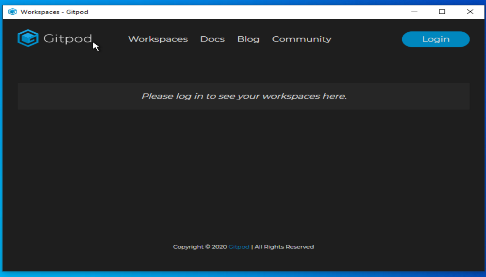

# Gitpod Desktop

Gitpod Desktop provides gitpod in a window, with shortcuts enabled.

### Contributing
To start in dev, you'll need Node.js, npm, and yarn.
Start with yarn start or build with yarn build.